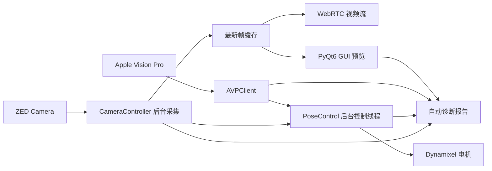

# RoboNeck-AVP 中文说明

RoboNeck-AVP 是一个 Python 桌面控制项目，用 Apple Vision Pro 的头部姿态驱动双轴机器人颈部机构。项目包含 AVP 会话连接、PyQt6 操作界面、ZED 相机接入、Dynamixel 电机控制、后台实时控制线程、自动延迟诊断和离线部署工具。

## 项目能力

- 使用 AVP 头部姿态控制机器人颈部 yaw / pitch 两个自由度
- 通过 PyQt6 GUI 完成 AVP、相机、电机、视频流和 tracking 操作
- 支持 ZED SDK / OpenCV 相机路径，并使用后台采集线程缓存最新帧
- 使用独立 tracking 控制线程下发电机指令，降低 GUI 和视频流对控制环的影响
- 支持自动诊断 tracking 延迟、AVP 样本老化、相机链路竞争和电机写入瓶颈
- 支持面向机器人端 PC 的离线打包、环境恢复和运行检查

## 架构概览



## 目录结构

| 路径 | 作用 |
| --- | --- |
| `src/core/` | AVP 客户端、会话切换、相机控制器、诊断采集、启动路径 |
| `src/gui/` | PyQt6 主窗口、Dashboard、Pose Control、相机面板、视频流界面 |
| `src/hardware/` | ZED / OpenCV 相机适配、Dynamixel 电机适配、mock 电机 |
| `src/utils/` | 姿态转换、retargeting、电机角度与步进换算 |
| `config/` | 运行参数、AVP 连接记录、tracking 起始姿态记录 |
| `tests/` | 自动化测试，使用 `pytest` |
| `tools/hardware_checks/` | AVP、相机、电机和延迟诊断脚本 |
| `tools/deployment/` | 机器人端离线打包、恢复、检查和启动脚本 |

## 环境要求

推荐使用 Python `3.10`，项目默认环境名为 `avp_teleop`。常用依赖包括：

- `PyQt6`
- `opencv-python`
- `pyzed` 与系统 ZED SDK
- `avp_stream`
- `dynamixel_sdk`
- `numpy`
- `pytest`

机器人端运行还需要：

- AVP 与机器人电脑处于可连通网络
- ZED 相机或兼容 UVC 相机
- Dynamixel USB 串口设备，例如 `/dev/ttyUSB0`
- 当前用户具备串口访问权限

## 快速启动

在项目根目录运行：

```bash
python src/main.py
```

推荐 GUI 操作顺序：

1. 在 Dashboard 中确认或填写 AVP IP
2. 点击 `Connect AVP`
3. 点击 `Connect Camera`
4. 点击 `Connect Motor`
5. 如需视频，点击 `Start Stream`
6. 进入 `Pose Control`，执行 home / calibration
7. 点击 `Start Tracking`

> 注意：如果现场排查延迟，建议先测试“只开 tracking、不启动视频流”的情况，再测试“先开视频流、再开 tracking”的情况。

## 关键配置

主要配置位于 `config/config.py`。

| 配置 | 说明 |
| --- | --- |
| `ROBO_NECK_AVP_IP` / `AVP_IP` | AVP 设备 IP |
| `ROBO_NECK_DYNAMIXEL_PORT` / `DYNAMIXEL_PORT` | Dynamixel 串口 |
| `STREAM_RESOLUTION` | 视频分辨率，默认 `3840x1080` |
| `STREAM_FPS` | 视频帧率，默认 `30` |
| `USE_ZED_SDK` | 是否优先使用 ZED SDK |
| `LOOP_RATE` | tracking 控制频率，默认 `60` Hz |
| `SMOOTHING_ALPHA` | 姿态平滑参数，越大响应越快但更容易抖 |
| `MOCK_AVP` | 无 AVP 时启用模拟输入 |
| `MOCK_MOTORS` | 无真实电机时启用模拟电机 |

示例：

```bash
ROBO_NECK_AVP_IP=192.168.0.10 ROBO_NECK_DYNAMIXEL_PORT=/dev/ttyUSB0 python src/main.py
```

## 自动诊断

如果出现 10 秒级延迟、卡顿、突然追赶、视频开启后 tracking 变慢等问题，使用自动诊断模式启动：

```bash
ROBO_NECK_DEBUG_TIMING=1 ROBO_NECK_DIAG_CAPTURE=1 python src/main.py
```

复现问题后关闭 GUI，然后生成诊断摘要：

```bash
python tools/hardware_checks/diagnose_tracking_latency.py
```

诊断输出位于：

```text
diagnostics/<timestamp>/
```

主要文件：

| 文件 | 内容 |
| --- | --- |
| `events.jsonl` | 原始结构化采样 |
| `summary.json` | 机器可读诊断摘要 |
| `summary.txt` | 现场可读根因排序 |

自动报告会尝试区分以下问题：

- `avp_input_stale`：AVP pose 样本老化或缺失
- `avp_session_switch_latency`：AVP session 切换后等待 ready 太久
- `camera_pipeline_contention`：相机采集或帧缓存链路异常
- `ui_control_thread_contention`：UI / 控制线程调度压力过高
- `motor_write_bottleneck`：电机写入耗时异常

如果怀疑相机诊断刷新影响主线程，可做对照测试：

```bash
ROBO_NECK_DEBUG_TIMING=1 ROBO_NECK_DIAG_CAPTURE=1 ROBO_NECK_DISABLE_CAMERA_DIAGNOSTICS=1 python src/main.py
```

## 硬件检查

常用检查命令：

```bash
python tools/hardware_checks/check_avp.py
python tools/hardware_checks/check_avp_connection.py
python tools/hardware_checks/check_camera.py
python tools/hardware_checks/check_motor.py
python tools/hardware_checks/scan_cameras.py
python tools/hardware_checks/scan_motors.py
```

延迟排查说明见：

```text
tools/hardware_checks/debug-tracking-latency.md
```

## 测试

运行全部自动化测试：

```bash
pytest
```

运行单个测试文件：

```bash
pytest tests/test_camera_controller.py -v
```

当前测试覆盖核心逻辑、UI 状态、相机缓存、AVP session 切换、诊断报告、部署工具和 tracking 起始姿态。

## 离线部署

在开发机打包：

```bash
source ~/anaconda3/etc/profile.d/conda.sh
conda activate avp_teleop
python -m pip install -U conda-pack
python tools/deployment/build_robot_bundle.py
```

产物位于：

```text
dist/robot_deploy/
dist/robot_deploy.tar.gz
```

复制到机器人端后解压，并运行：

```bash
cd /home/unitree/robotneck/robot_deploy
bash tools/deployment/restore_robot_env.sh
python tools/deployment/check_robot_env.py
bash tools/deployment/run_robot_gui.sh
```

如果机器人架构与开发机不同，建议在机器人端创建原生 Conda 环境：

```bash
bash tools/deployment/create_robot_conda_env.sh
conda activate avp_teleop
python tools/deployment/check_robot_env.py
bash tools/deployment/run_robot_gui.sh
```

## 常见问题

### 开视频后 tracking 变慢

先用自动诊断采集一组报告。重点查看 `summary.txt` 中的 `top_cause`。如果是 `camera_pipeline_contention`，优先检查相机分辨率、帧率、USB 带宽和 ZED SDK 状态。如果是 `avp_input_stale`，优先检查 AVP 网络、App 状态和 session 切换。

### 电机一直慢半拍

如果诊断显示 AVP 样本新鲜、控制线程频率正常、电机写入不慢，再考虑调参。可先将 `SMOOTHING_ALPHA` 从 `0.4` 试到 `0.5`，再逐步调整电机 profile acceleration。不要同时修改多个参数。

### 无法连接电机

检查串口和权限：

```bash
ls /dev/ttyUSB*
python tools/hardware_checks/scan_motors.py
python tools/hardware_checks/check_motor.py
```

确认 `config/config.py` 或 `ROBO_NECK_DYNAMIXEL_PORT` 指向正确设备。

### 相机无法打开

先确认设备和 SDK：

```bash
python tools/hardware_checks/scan_cameras.py
python tools/hardware_checks/check_camera.py
python -c "import pyzed.sl as sl; print(sl)"
```

如果没有 ZED SDK，可临时检查 OpenCV/UVC 路径，但真实部署建议安装匹配机器人系统的 ZED SDK。

## 维护建议

- 不要提交 `dist/`、`diagnostics/` 或机器本地路径
- 修改硬件流程时同步更新 `tools/hardware_checks/README.md`
- 修改部署流程时同步更新 `tools/deployment/README.md`
- 修改 GUI 行为时附带截图或现场操作说明
- 提交前至少运行 `pytest`
